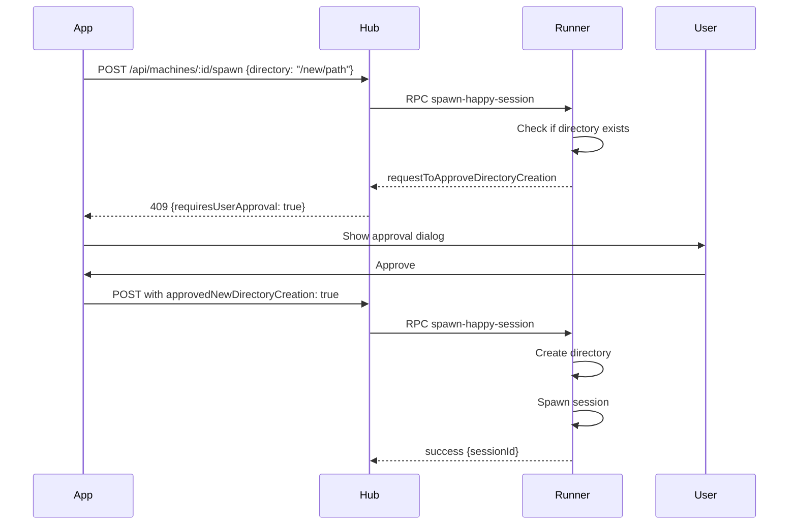

The HAPI runner is a persistent background process that manages AI coding sessions, enables remote control from web and mobile apps, and handles automatic updates when the CLI version changes.

## Overview

The runner acts as a daemon that:

<CardGroup cols={2}>
  <Card title="Remote Control" icon="mobile">
    Enables session management from web and Telegram Mini App
  </Card>
  <Card title="Session Isolation" icon="shield">
    Spawns detached sessions that survive runner restarts
  </Card>
  <Card title="Auto-Updates" icon="rotate">
    Automatically restarts when CLI is upgraded
  </Card>
  <Card title="Health Monitoring" icon="heart-pulse">
    Tracks session health and prunes stale processes
  </Card>
</CardGroup>

## Runner Commands

### Start Runner

Start the runner as a detached background process:

```bash
hapi runner start
```

The runner will:
- Register the machine with the hub
- Open a WebSocket connection for real-time communication
- Start an HTTP control server on a random port (localhost only)
- Begin heartbeat monitoring every 60 seconds

<Info>
If a runner is already running with the same CLI version, the command exits immediately. If the version differs, the old runner is stopped first.
</Info>

### Stop Runner

Gracefully stop the background runner:

```bash
hapi runner stop
```

This triggers a clean shutdown:
1. Updates runner state to "shutting-down" on the hub
2. Closes WebSocket connection
3. Stops HTTP control server
4. Cleans up state files and lock files
5. Exits the process

<Warning>
Stopping the runner does NOT terminate active sessions. Sessions run as detached processes and continue independently.
</Warning>

### Runner Status

View detailed runner diagnostics:

```bash
hapi runner status
```

**Output includes:**
- Runner process ID and uptime
- CLI version and modification time
- HTTP control port
- Last heartbeat timestamp
- Path to runner log file

### List Active Sessions

Show all sessions managed by the runner:

```bash
hapi runner list
```

**Output format:**
```
Active Sessions (2):
  - Session: abc-123-def  PID: 12345  Started by: runner
  - Session: xyz-789-ghi  PID: 12346  Started by: hapi directly - likely by user from terminal
```

### Stop Specific Session

Terminate a single session by ID:

```bash
hapi runner stop-session <sessionId>
```

Also accepts PID format:
```bash
hapi runner stop-session PID-12345
```

### View Runner Logs

Get the path to the latest runner log file:

```bash
hapi runner logs
```

Then view the logs:
```bash
tail -f $(hapi runner logs)
```

## Runner State and Heartbeat

The runner maintains state in `~/.hapi/runner.state.json` (or `$HAPI_HOME/runner.state.json`):

```json
{
  "pid": 12345,
  "httpPort": 50097,
  "startTime": "8/24/2025, 6:46:22 PM",
  "startedWithCliVersion": "0.9.0-6",
  "startedWithCliMtimeMs": 1724531182000,
  "lastHeartbeat": "8/24/2025, 6:47:22 PM",
  "runnerLogPath": "/Users/you/.hapi/logs/runner-20250824-184622.log"
}
```

### Heartbeat System

Every 60 seconds (configurable via `HAPI_RUNNER_HEARTBEAT_INTERVAL`), the runner:

<Steps>
  <Step title="Prune Stale Sessions">
    Checks each tracked PID with `isProcessAlive()` and removes dead sessions from the tracking map.
  </Step>
  <Step title="Version Check">
    Compares CLI binary modification time with startup mtime. If changed, spawns new runner and waits to be killed.
  </Step>
  <Step title="PID Ownership Verification">
    Verifies the runner still owns the state file. If another runner took over, terminates self.
  </Step>
  <Step title="Write Heartbeat">
    Updates `lastHeartbeat` timestamp in `runner.state.json`.
  </Step>
</Steps>

<Info>
The heartbeat uses a guard to prevent concurrent executions. If the previous heartbeat is still running, the current cycle is skipped.
</Info>

## Configuration

Configure runner behavior with environment variables:

### HAPI_RUNNER_HEARTBEAT_INTERVAL

Control how often the runner performs health checks:

```bash
# Default: 60000 (60 seconds)
export HAPI_RUNNER_HEARTBEAT_INTERVAL=30000  # 30 seconds
```

<Warning>
Setting this too low (< 10 seconds) may cause performance issues. Setting it too high (> 5 minutes) delays version detection and session cleanup.
</Warning>

### HAPI_RUNNER_HTTP_TIMEOUT

Timeout for HTTP control requests:

```bash
# Default: 10000 (10 seconds)
export HAPI_RUNNER_HTTP_TIMEOUT=15000  # 15 seconds
```

Used by:
- `hapi runner stop`
- `hapi runner list`
- `hapi runner stop-session`
- Internal runner control operations

## Runner Architecture

### HTTP Control Server

The runner starts a local Fastify server on `127.0.0.1` with a random port. This server provides:

<AccordionGroup>
  <Accordion title="POST /session-started">
    **Purpose:** Sessions report themselves after creation
    
    **Request:**
    ```json
    {
      "sessionId": "abc-123-def",
      "metadata": { "hostPid": 12345, "startedBy": "runner" }
    }
    ```
    
    **Response:**
    ```json
    { "status": "ok" }
    ```
  </Accordion>

  <Accordion title="POST /list">
    **Purpose:** List all tracked sessions
    
    **Response:**
    ```json
    {
      "children": [
        { "startedBy": "runner", "happySessionId": "abc-123", "pid": 12345 }
      ]
    }
    ```
  </Accordion>

  <Accordion title="POST /stop-session">
    **Purpose:** Terminate a specific session
    
    **Request:**
    ```json
    { "sessionId": "abc-123-def" }
    ```
    
    **Response:**
    ```json
    { "success": true }
    ```
  </Accordion>

  <Accordion title="POST /stop">
    **Purpose:** Gracefully shutdown the runner
    
    **Response:**
    ```json
    { "status": "stopping" }
    ```
  </Accordion>
</AccordionGroup>

### WebSocket Communication

The runner maintains a WebSocket connection to the hub on the `/cli` namespace:

**Runner → Hub:**
- `machine-alive`: Heartbeat every 20 seconds
- `machine-update-metadata`: Static machine info changes
- `machine-update-state`: Runner status changes

**Hub → Runner (RPC):**
- `spawn-happy-session`: Spawn new session remotely
- `stop-session`: Stop session by ID
- `stop-runner`: Request shutdown

## Use Cases

<CardGroup cols={2}>
  <Card title="Remote Development" icon="globe">
    Control sessions on your development machine from your phone or a remote browser
  </Card>
  <Card title="Long-Running Tasks" icon="clock">
    Keep sessions alive while closing your terminal or laptop
  </Card>
  <Card title="Multi-Machine Setup" icon="server">
    Manage sessions across multiple development machines from a single web interface
  </Card>
  <Card title="Team Collaboration" icon="users">
    Team members can spawn sessions on shared development servers
  </Card>
</CardGroup>

## Session Spawning

The runner supports two types of session spawning:

### Runner-Spawned Sessions (Remote)

Initiated via web/mobile app:

<Steps>
  <Step title="User Requests Session">
    User clicks "New Session" in web app or Telegram Mini App
  </Step>
  <Step title="Hub Sends RPC">
    Hub forwards RPC `spawn-happy-session` to runner via WebSocket
  </Step>
  <Step title="Runner Spawns Process">
    Runner spawns detached HAPI process with `--hapi-starting-mode remote --started-by runner`
  </Step>
  <Step title="Session Reports">
    New session POSTs to runner's `/session-started` endpoint with metadata
  </Step>
  <Step title="RPC Response">
    Runner returns session ID to hub, which forwards to mobile app
  </Step>
</Steps>

### Terminal-Spawned Sessions

User runs `hapi` directly in terminal:

1. CLI auto-starts runner if not running (optional behavior)
2. HAPI process calls `notifyRunnerSessionStarted()` webhook
3. Runner tracks session with `startedBy: 'hapi directly - likely by user from terminal'`
4. Session continues independently

## Automatic Version Detection

The runner automatically restarts when you upgrade the HAPI CLI:

<Steps>
  <Step title="CLI Upgrade">
    User runs `npm upgrade hapi-cli` or similar
  </Step>
  <Step title="Mtime Changes">
    CLI binary modification time changes
  </Step>
  <Step title="Heartbeat Detects Change">
    Next heartbeat compares current mtime with recorded `startedWithCliMtimeMs`
  </Step>
  <Step title="Spawn New Runner">
    Current runner spawns new runner via `hapi runner start`
  </Step>
  <Step title="New Runner Takes Over">
    New runner detects version mismatch and stops old runner
  </Step>
  <Step title="Seamless Transition">
    Sessions continue running; only runner process is replaced
  </Step>
</Steps>

<Info>
This ensures you're always running the latest runner code without manual intervention.
</Info>

## Lock File and State Management

The runner uses file-based locking to prevent multiple instances:

**Lock file:** `~/.hapi/runner.state.json.lock`
- Created with O_EXCL flag (atomic operation)
- Contains PID for debugging
- Automatically cleaned up on graceful shutdown

**State file:** `~/.hapi/runner.state.json`
- Written without lock (concurrent reads are safe)
- Contains PID, port, version, and heartbeat data
- Used by CLI commands to communicate with runner

## Troubleshooting

### Runner Won't Start

<AccordionGroup>
  <Accordion title="Lock file already held">
    Another runner is already running. Check status with:
    ```bash
    hapi runner status
    ```
    
    If you believe this is an error, stop the existing runner:
    ```bash
    hapi runner stop
    ```
  </Accordion>

  <Accordion title="Port conflict">
    The HTTP control server uses a random port. If all ports are exhausted (unlikely), check available ports:
    ```bash
    netstat -an | grep LISTEN
    ```
  </Accordion>

  <Accordion title="Authentication failure">
    Ensure `CLI_API_TOKEN` is set correctly:
    ```bash
    hapi auth status
    ```
  </Accordion>
</AccordionGroup>

### Sessions Not Appearing

1. Check if runner is running: `hapi runner status`
2. Check runner logs: `tail -f $(hapi runner logs)`
3. Verify session webhook reached runner (should see `[RUNNER RUN] Session reported` in logs)
4. Check if session process is alive: `hapi runner list`

### Runner Keeps Restarting

This usually indicates the CLI binary is being modified repeatedly. Common causes:

- Active development with `bun run build:cli:exe` running in watch mode
- File system timestamp issues
- Antivirus software modifying the binary

Check the logs for version mismatch messages:
```bash
tail -f $(hapi runner logs) | grep "version mismatch"
```

## Advanced: Directory Creation Approval

When spawning sessions remotely, the runner can request approval for directory creation:



Error handling includes specific messages for:
- `EACCES`: Permission denied
- `ENOTDIR`: File exists at path
- `ENOSPC`: Disk full
- `EROFS`: Read-only filesystem

## Related Topics

<CardGroup cols={3}>
  <Card title="Worktrees" href="/advanced/worktrees" icon="git-alt">
    Git worktree support for isolated branches
  </Card>
  <Card title="Configuration" href="/advanced/configuration" icon="gear">
    All environment variables and settings
  </Card>
  <Card title="Namespaces" href="/advanced/namespaces" icon="users">
    Multi-user isolation on shared hubs
  </Card>
</CardGroup>
