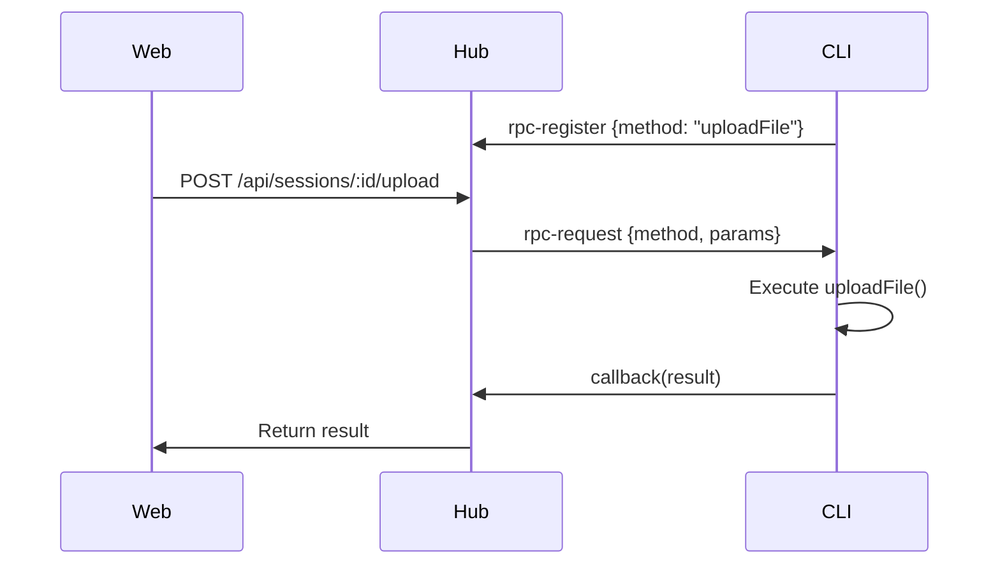

## Overview

HAPI uses an RPC (Remote Procedure Call) system to enable the web app to invoke methods on the CLI.

**Flow:**

1. **CLI registers** RPC handlers via Socket.IO
2. **Web calls** REST endpoint
3. **Hub routes** to CLI via Socket.IO `rpc-request` event
4. **CLI executes** method and returns result
5. **Hub returns** result to web

## Architecture



## Registering Handlers

### CLI Side

```typescript
import { io } from 'socket.io-client'

const socket = io('http://127.0.0.1:3006/cli', {
  auth: {
    sessionId: 'abc123',
    namespace: 'default'
  }
})

// Register RPC method
socket.emit('rpc-register', {
  method: 'uploadFile'
})

// Handle RPC requests
socket.on('rpc-request', async (data, callback) => {
  const { method, params } = data
  const parsedParams = JSON.parse(params)
  
  try {
    let result
    
    switch (method) {
      case 'uploadFile':
        result = await handleUploadFile(parsedParams)
        break
      case 'deleteUploadFile':
        result = await handleDeleteUpload(parsedParams)
        break
      case 'checkPathExists':
        result = await handleCheckPath(parsedParams)
        break
      case 'gitStatus':
        result = await handleGitStatus(parsedParams)
        break
      default:
        result = { success: false, error: 'Unknown method' }
    }
    
    callback(JSON.stringify(result))
  } catch (error) {
    callback(JSON.stringify({
      success: false,
      error: error instanceof Error ? error.message : 'Unknown error'
    }))
  }
})

// Unregister on disconnect
socket.on('disconnect', () => {
  socket.emit('rpc-unregister', { method: 'uploadFile' })
})
```

## Common RPC Methods

### uploadFile

**Called by:** `POST /api/sessions/:id/upload`

**Params:**

```typescript
{
  filename: string
  content: string  // base64
  mimeType: string
}
```

**Returns:**

```typescript
{
  success: boolean
  path?: string
  error?: string
}
```

**Implementation Example:**

```typescript
async function handleUploadFile(params: any) {
  const { filename, content, mimeType } = params
  const buffer = Buffer.from(content, 'base64')
  const tmpPath = `/tmp/hapi-upload-${sessionId}-${filename}`
  
  await fs.writeFile(tmpPath, buffer)
  
  return {
    success: true,
    path: tmpPath
  }
}
```

---

### deleteUploadFile

**Called by:** `POST /api/sessions/:id/upload/delete`

**Params:**

```typescript
{
  path: string
}
```

**Returns:**

```typescript
{
  success: boolean
  error?: string
}
```

---

### checkPathExists

**Called by:** `POST /api/machines/:id/paths/exists`

**Params:**

```typescript
{
  paths: string[]
}
```

**Returns:**

```typescript
{
  [path: string]: boolean
}
```

**Implementation Example:**

```typescript
async function handleCheckPath(params: any) {
  const { paths } = params
  const result: Record<string, boolean> = {}
  
  for (const path of paths) {
    try {
      await fs.access(path)
      result[path] = true
    } catch {
      result[path] = false
    }
  }
  
  return result
}
```

---

### gitStatus

**Called by:** `GET /api/sessions/:id/git-status`

**Params:**

```typescript
{
  cwd: string
}
```

**Returns:**

```typescript
{
  success: boolean
  branch?: string
  files?: Array<{
    path: string
    status: string
  }>
  error?: string
}
```

---

### gitDiffNumstat

**Called by:** `GET /api/sessions/:id/git-diff-numstat`

**Params:**

```typescript
{
  cwd: string
  staged?: boolean
}
```

**Returns:**

```typescript
{
  success: boolean
  files?: Array<{
    path: string
    added: number
    removed: number
  }>
  error?: string
}
```

---

### gitDiffFile

**Called by:** `GET /api/sessions/:id/git-diff-file`

**Params:**

```typescript
{
  cwd: string
  filePath: string
  staged?: boolean
}
```

**Returns:**

```typescript
{
  success: boolean
  diff?: string
  error?: string
}
```

---

### readFile

**Called by:** `GET /api/sessions/:id/file`

**Params:**

```typescript
{
  path: string
}
```

**Returns:**

```typescript
{
  success: boolean
  content?: string
  error?: string
}
```

---

### runRipgrep

**Called by:** `GET /api/sessions/:id/files`

**Params:**

```typescript
{
  args: string[]
  cwd: string
}
```

**Returns:**

```typescript
{
  success: boolean
  stdout?: string
  stderr?: string
  error?: string
}
```

---

### listDirectory

**Called by:** `GET /api/sessions/:id/directory`

**Params:**

```typescript
{
  path: string
}
```

**Returns:**

```typescript
{
  success: boolean
  entries?: Array<{
    name: string
    type: 'file' | 'directory'
    size?: number
  }>
  error?: string
}
```

---

### spawnSession

**Called by:** `POST /api/machines/:id/spawn`

**Params:**

```typescript
{
  directory: string
  agent?: 'claude' | 'codex' | 'cursor' | 'gemini' | 'opencode'
  model?: string
  yolo?: boolean
  sessionType?: 'simple' | 'worktree'
  worktreeName?: string
}
```

**Returns:**

```typescript
{
  success: boolean
  sessionId?: string
  error?: string
}
```

---

### listSlashCommands

**Called by:** `GET /api/sessions/:id/slash-commands`

**Params:**

```typescript
{
  agent: string
}
```

**Returns:**

```typescript
{
  success: boolean
  commands?: string[]
  error?: string
}
```

---

### listSkills

**Called by:** `GET /api/sessions/:id/skills`

**Params:** None

**Returns:**

```typescript
{
  success: boolean
  skills?: Array<{
    name: string
    description: string
  }>
  error?: string
}
```

---

## Error Handling

### Timeout

RPC calls timeout after 30 seconds by default:

```typescript
const result = await engine.callRpc(
  sessionId,
  'uploadFile',
  params,
  30000  // 30 second timeout
)
```

### No Handler Registered

If no CLI has registered the method:

```json
{
  "success": false,
  "error": "No handler registered for method"
}
```

### CLI Error

If the CLI handler throws an error:

```json
{
  "success": false,
  "error": "File not found: /tmp/upload.txt"
}
```

## Hub-Side Implementation

### RPC Registry

The hub maintains a registry mapping methods to sockets:

```typescript
class RpcRegistry {
  private handlers = new Map<string, Socket>()
  
  register(socket: Socket, method: string) {
    this.handlers.set(method, socket)
  }
  
  unregister(socket: Socket, method: string) {
    if (this.handlers.get(method) === socket) {
      this.handlers.delete(method)
    }
  }
  
  async call(method: string, params: any, timeout = 30000): Promise<any> {
    const socket = this.handlers.get(method)
    if (!socket) {
      throw new Error('No handler registered')
    }
    
    return new Promise((resolve, reject) => {
      const timer = setTimeout(() => {
        reject(new Error('RPC timeout'))
      }, timeout)
      
      socket.emit('rpc-request', 
        {
          method,
          params: JSON.stringify(params)
        },
        (response: string) => {
          clearTimeout(timer)
          resolve(JSON.parse(response))
        }
      )
    })
  }
}
```

### Calling RPC from REST

```typescript
app.post('/sessions/:id/upload', async (c) => {
  const sessionId = c.req.param('id')
  const { filename, content, mimeType } = await c.req.json()
  
  const result = await rpcGateway.call('uploadFile', {
    filename,
    content,
    mimeType
  })
  
  return c.json(result)
})
```

## Best Practices

1. **Register on connect** - Register all RPC methods immediately after connecting
2. **Unregister on disconnect** - Clean up handlers when socket disconnects
3. **Handle errors** - Always wrap handler code in try/catch
4. **Return structured responses** - Use `{success, ...}` format
5. **Validate params** - Check parameter types and values
6. **Set timeouts** - Use reasonable timeouts for long operations
7. **Log failures** - Log RPC errors for debugging
