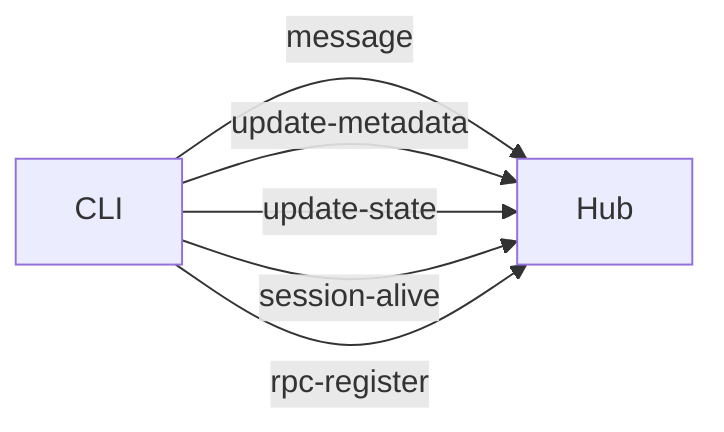
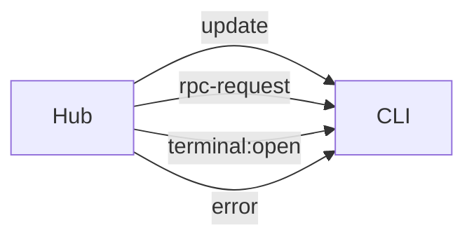

## Overview

HAPI Hub uses Socket.IO for bidirectional real-time communication between the CLI and hub.

## Namespace

CLI connections use the `/cli` namespace:

```
ws://127.0.0.1:3006/cli
```

## Connection Process

### 1. CLI Connects to Hub

```javascript
import { io } from 'socket.io-client'

const socket = io('http://127.0.0.1:3006/cli', {
  auth: {
    sessionId: 'abc123',  // Optional: join session room
    machineId: 'machine_xyz',  // Optional: join machine room
    namespace: 'default'  // Required: user namespace
  },
  transports: ['websocket', 'polling']
})
```

### 2. Authentication

Authentication is performed via the `auth` object in the handshake:

<ParamField name="namespace" type="string" required>
  User namespace for isolation
</ParamField>

<ParamField name="sessionId" type="string" optional>
  Session ID to join (CLI joins its own session room)
</ParamField>

<ParamField name="machineId" type="string" optional>
  Machine ID to join (CLI joins its machine room)
</ParamField>

### 3. Rooms

When authenticated, the socket automatically joins rooms:

- `session:<sessionId>` - Receives updates for this session
- `machine:<machineId>` - Receives updates for this machine

## Connection Example

```typescript
import { io, Socket } from 'socket.io-client'
import type { ClientToServerEvents, ServerToClientEvents } from '@hapi/protocol'

type TypedSocket = Socket<ServerToClientEvents, ClientToServerEvents>

const socket: TypedSocket = io('http://127.0.0.1:3006/cli', {
  auth: {
    sessionId: 'abc123',
    machineId: 'machine_xyz',
    namespace: 'default'
  }
})

socket.on('connect', () => {
  console.log('Connected to hub:', socket.id)
})

socket.on('disconnect', (reason) => {
  console.log('Disconnected:', reason)
})

socket.on('error', (data) => {
  console.error('Socket error:', data)
})
```

## Event Flow

### CLI to Hub



### Hub to CLI



### Hub to Web

Web clients receive updates via:
- **SSE** (`GET /api/events`) - One-way events
- **REST API** - Request/response

## Error Handling

The hub emits `error` events for:

### Access Errors

```typescript
socket.on('error', (data) => {
  if (data.code === 'access-denied') {
    // Session/machine belongs to different namespace
  } else if (data.code === 'not-found') {
    // Session/machine doesn't exist
  } else if (data.code === 'namespace-missing') {
    // Client didn't provide namespace in auth
  }
})
```

### Error Structure

```typescript
interface SocketError {
  message: string
  code?: 'namespace-missing' | 'access-denied' | 'not-found'
  scope?: 'session' | 'machine'
  id?: string  // Session or machine ID
}
```

## Reconnection

Socket.IO automatically handles reconnection:

```javascript
socket.io.on('reconnect', (attempt) => {
  console.log('Reconnected after', attempt, 'attempts')
})

socket.io.on('reconnect_attempt', (attempt) => {
  console.log('Reconnection attempt', attempt)
})

socket.io.on('reconnect_failed', () => {
  console.error('Reconnection failed')
})
```

### Custom Reconnection Logic

```javascript
const socket = io('http://127.0.0.1:3006/cli', {
  auth: { sessionId: 'abc123', namespace: 'default' },
  reconnection: true,
  reconnectionAttempts: 10,
  reconnectionDelay: 1000,
  reconnectionDelayMax: 5000
})
```

## Heartbeat

The CLI should send periodic heartbeats:

### Session Heartbeat

```javascript
setInterval(() => {
  socket.emit('session-alive', {
    sid: 'abc123',
    time: Date.now(),
    thinking: false,
    mode: 'remote',
    permissionMode: 'default'
  })
}, 5000)  // Every 5 seconds
```

### Machine Heartbeat

```javascript
setInterval(() => {
  socket.emit('machine-alive', {
    machineId: 'machine_xyz',
    time: Date.now()
  })
}, 10000)  // Every 10 seconds
```

## Ping/Pong

Test connection latency:

```javascript
socket.emit('ping', () => {
  console.log('Pong received')
})
```

## Transport Options

Socket.IO supports multiple transports:

### WebSocket Only (Recommended)

```javascript
const socket = io('http://127.0.0.1:3006/cli', {
  transports: ['websocket']
})
```

### WebSocket with Polling Fallback

```javascript
const socket = io('http://127.0.0.1:3006/cli', {
  transports: ['websocket', 'polling']
})
```

## CORS Configuration

Configure CORS for Socket.IO connections:

```bash
CORS_ORIGINS=https://app.example.com,https://other.example.com
# or
CORS_ORIGINS=*
```

The hub automatically allows:
- Same-origin requests
- Origins derived from `HAPI_PUBLIC_URL`
- Origins in `CORS_ORIGINS`

## Security

### Namespace Isolation

All operations are scoped to the authenticated namespace:

- Sessions and machines are filtered by namespace
- Cross-namespace access returns `access-denied` error
- Each namespace is isolated (multi-tenant)

### No Token Auth

Socket.IO connections don't use JWT tokens. Instead:

1. CLI connects with `namespace` in auth
2. Hub validates namespace exists
3. CLI can only access resources in its namespace

### Session/Machine Ownership

The hub verifies:

- Session belongs to the namespace
- Machine belongs to the namespace
- No cross-namespace data leakage

## Next Steps

<CardGroup cols={2}>
  <Card title="Socket Events" icon="bolt" href="/api/socket-events">
    Detailed event documentation
  </Card>
  <Card title="RPC" icon="arrows-left-right" href="/api/rpc">
    Remote procedure calls
  </Card>
</CardGroup>
