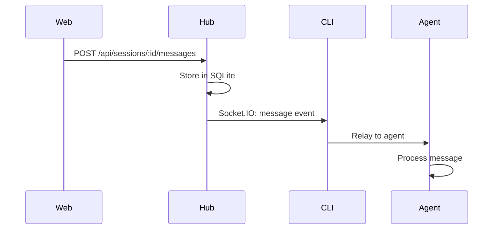

## Session Lifecycle

A HAPI session represents a single conversation with an AI coding agent. Sessions can be controlled locally from the terminal or remotely via web/PWA/Telegram, with seamless handoff between modes.

<Steps>
  <Step title="Session Creation">
    User runs `hapi`, `hapi codex`, or other agent command. CLI generates a unique session ID and connects to Hub.
  </Step>
  <Step title="Registration">
    CLI registers session with Hub via REST API (`POST /cli/sessions`). Hub creates entry in SQLite and broadcasts to web clients.
  </Step>
  <Step title="Active Phase">
    Session enters active state. Messages flow between user, agent, and Hub. Permission requests are handled in real-time.
  </Step>
  <Step title="Completion">
    Session ends when agent completes or user aborts. CLI sends `session-end` event. Session becomes inactive but remains in history.
  </Step>
  <Step title="Archival (Optional)">
    User can archive session via web UI or manually delete inactive sessions.
  </Step>
</Steps>

## Local vs Remote Modes

HAPI's defining feature is the ability to seamlessly switch between local and remote control without losing session state.

### Local Mode

<Card title="Direct Terminal Control" icon="terminal">
  - Full terminal UI with syntax highlighting
  - Direct keyboard input with instant response
  - Best for focused, uninterrupted coding sessions
  - All AI processing happens locally on your machine
</Card>

**When Local:**
- Session runs in foreground of terminal
- User types directly into CLI
- Agent responses stream to terminal
- Terminal UI shows thinking indicators

```bash
# Example: Starting a Claude session in local mode
$ hapi
✓ Connected to hub
✓ Session started: ses_abc123

┌─ Claude Code Session ─────────────────────────┐
│ Mode: Local                                   │
│ Path: /home/user/project                      │
│ Permission: Default                           │
└───────────────────────────────────────────────┘

You: Help me refactor this component
```

### Remote Mode

<Card title="Web/Phone Control" icon="mobile">
  - Control via PWA, browser, or Telegram
  - Approve permissions on the go
  - Monitor progress while away from desk
  - Session continues running on local machine
</Card>

**When Remote:**
- Session waits for web/Telegram input
- Terminal shows "Remote mode - waiting for input"
- User sends messages from phone/web
- Responses stream to all connected clients via SSE

### Mode Switching

<Tabs>
  <Tab title="Local → Remote">
    **Automatic switch** when message arrives from web/phone:

    <Steps>
      <Step title="Web Message Sent">
        User sends message from phone: "Add error handling"
      </Step>
      <Step title="Hub Routes to CLI">
        Hub receives REST request, emits Socket.IO event to CLI
      </Step>
      <Step title="CLI Switches Mode">
        CLI detects remote message, switches to remote mode
      </Step>
      <Step title="Terminal Updates">
        Terminal UI shows: `Remote mode - waiting for input`
      </Step>
      <Step title="Agent Processes">
        Agent receives message and starts processing
      </Step>
    </Steps>

    ```
    ┌─────────────────────────────────────────────┐
    │ Remote mode - waiting for input             │
    │ Press space twice to regain control         │
    └─────────────────────────────────────────────┘
    ```
  </Tab>
  <Tab title="Remote → Local">
    **Manual switch** by pressing space twice in terminal:

    <Steps>
      <Step title="User Presses Space">
        While in remote mode, press space twice quickly
      </Step>
      <Step title="CLI Switches Mode">
        CLI switches back to local mode
      </Step>
      <Step title="Terminal Updates">
        Terminal UI shows input prompt
      </Step>
      <Step title="User Types">
        User can immediately start typing
      </Step>
    </Steps>

    ```
    # Before: Remote mode
    Remote mode - waiting for input

    # After: Double-space press
    You: ▊
    ```
  </Tab>
</Tabs>

<Note>
Mode switching is instantaneous and preserves full session state. The agent doesn't restart or lose context.
</Note>

## Message Flow

### User Message → Agent

<Steps>
  <Step title="Web Client">
    User types message in web chat interface and clicks send.
  </Step>
  <Step title="REST Request">
    Web sends `POST /api/sessions/:id/messages` with message content.
  </Step>
  <Step title="Hub Validation">
    Hub validates message, stores in SQLite, assigns sequence number.
  </Step>
  <Step title="Socket.IO Emit">
    Hub emits `message` event to CLI via Socket.IO.
  </Step>
  <Step title="CLI Relay">
    CLI relays message to AI agent (Claude/Codex/etc).
  </Step>
  <Step title="Agent Processing">
    Agent begins processing and generates response.
  </Step>
</Steps>



### Agent Response → User

<Steps>
  <Step title="Agent Output">
    Agent generates response (text, tool calls, etc).
  </Step>
  <Step title="CLI Capture">
    CLI captures agent output and wraps in message format.
  </Step>
  <Step title="Socket.IO Emit">
    CLI emits message to Hub via Socket.IO.
  </Step>
  <Step title="Hub Processing">
    Hub stores message, updates session state, increments version.
  </Step>
  <Step title="SSE Broadcast">
    Hub broadcasts `message-received` event to all SSE subscribers.
  </Step>
  <Step title="Web Update">
    Web receives SSE event, invalidates query cache, UI updates.
  </Step>
</Steps>

```typescript
// Web SSE handler (from web/src/hooks/useSSE.ts pattern)
sse.addEventListener('message', (event) => {
  const syncEvent = JSON.parse(event.data)
  
  if (syncEvent.type === 'message-received') {
    // Invalidate TanStack Query cache
    queryClient.invalidateQueries({
      queryKey: ['sessions', syncEvent.sessionId, 'messages']
    })
  }
})
```

## Permission System Flow

HAPI's permission system allows remote approval of agent tool usage.

### Permission Request

<Steps>
  <Step title="Agent Requests Permission">
    Agent wants to use a tool (e.g., `edit_file`).
  </Step>
  <Step title="CLI Creates Request">
    CLI generates permission request with unique ID.
  </Step>
  <Step title="Update Agent State">
    CLI calls `update-state` with request in `agentState.requests`.
  </Step>
  <Step title="Hub Stores & Notifies">
    Hub stores request, sends Telegram notification, broadcasts via SSE.
  </Step>
  <Step title="User Notified">
    User receives push notification or Telegram message with approve/deny buttons.
  </Step>
</Steps>

```typescript
// From shared/src/schemas.ts
type AgentState = {
  controlledByUser?: boolean
  requests?: Record<string, AgentStateRequest>
  completedRequests?: Record<string, AgentStateCompletedRequest>
}

type AgentStateRequest = {
  tool: string
  arguments: unknown
  createdAt: number
}
```

### Permission Approval

<Steps>
  <Step title="User Approves">
    User taps "Approve" in web UI or Telegram.
  </Step>
  <Step title="REST Request">
    Web sends `POST /api/sessions/:id/permissions/:requestId/approve`.
  </Step>
  <Step title="Hub RPC">
    Hub routes to CLI via RPC gateway.
  </Step>
  <Step title="CLI Completes Request">
    CLI moves request from `requests` to `completedRequests` with status `approved`.
  </Step>
  <Step title="Agent Continues">
    Agent receives approval signal and executes tool.
  </Step>
</Steps>

<Tabs>
  <Tab title="Approve">
    ```typescript
    // Web API call
    await fetch(`${hubUrl}/api/sessions/${sessionId}/permissions/${requestId}/approve`, {
      method: 'POST',
      headers: { Authorization: `Bearer ${token}` }
    })

    // Hub routes to CLI via RPC
    socket.emit('rpc-request', {
      method: 'approve-permission',
      params: JSON.stringify({ requestId })
    }, (response) => {
      // Success
    })
    ```
  </Tab>
  <Tab title="Deny">
    ```typescript
    // Web API call
    await fetch(`${hubUrl}/api/sessions/${sessionId}/permissions/${requestId}/deny`, {
      method: 'POST',
      headers: { Authorization: `Bearer ${token}` }
    })

    // Hub routes to CLI via RPC
    socket.emit('rpc-request', {
      method: 'deny-permission',
      params: JSON.stringify({ requestId })
    }, (response) => {
      // Success
    })
    ```
  </Tab>
</Tabs>

<Check>
Permission requests are persisted in SQLite. If the user is offline, they can approve/deny later without losing the request.
</Check>

## Real-Time Updates via SSE

Server-Sent Events provide a unidirectional stream from Hub to Web for live updates.

### SSE Connection

```typescript
// Web establishes SSE connection
const eventSource = new EventSource(`${hubUrl}/api/events?token=${token}`)

eventSource.addEventListener('message', (event) => {
  const syncEvent: SyncEvent = JSON.parse(event.data)
  
  switch (syncEvent.type) {
    case 'session-added':
      // New session appeared
      break
    case 'session-updated':
      // Session metadata or state changed
      break
    case 'message-received':
      // New message in session
      break
    case 'machine-updated':
      // Machine status changed
      break
    case 'toast':
      // Show notification
      break
  }
})
```

### Event Types

<CardGroup cols={2}>
  <Card title="session-added" icon="plus">
    New session created. Web adds to session list.
  </Card>
  <Card title="session-updated" icon="pen">
    Session metadata or agent state changed. Web invalidates cache.
  </Card>
  <Card title="message-received" icon="message">
    New message in session. Web fetches latest messages.
  </Card>
  <Card title="machine-updated" icon="server">
    Machine came online/offline. Web updates machine list.
  </Card>
  <Card title="toast" icon="bell">
    Notification to display. Web shows toast message.
  </Card>
  <Card title="heartbeat" icon="heart">
    Keep-alive ping. Web verifies connection is active.
  </Card>
</CardGroup>

<Info>
SSE automatically reconnects on disconnect. The Hub sends a `heartbeat` event every 30 seconds to detect broken connections.
</Info>

## Message Synchronization

### Sequence Numbers

Every message gets a unique, monotonically increasing sequence number per session:

```typescript
// From shared/src/schemas.ts
type DecryptedMessage = {
  id: string          // Unique message ID
  seq: number         // Sequence number (1, 2, 3, ...)
  localId: string | null  // Optional local ID for optimistic updates
  content: unknown    // Message content (tool calls, text, etc)
  createdAt: number   // Unix timestamp (ms)
}
```

<Note>
Sequence numbers enable efficient pagination and gap detection. Web can request "messages after seq 50" to fetch only new messages.
</Note>

### Optimistic Updates

Web uses `localId` for optimistic UI updates:

<Steps>
  <Step title="User Sends Message">
    Web generates `localId`, immediately adds message to UI with "sending" state.
  </Step>
  <Step title="REST Request">
    Web sends `POST /api/sessions/:id/messages` with `localId`.
  </Step>
  <Step title="Hub Assigns Seq">
    Hub stores message, assigns sequence number, includes `localId` in response.
  </Step>
  <Step title="SSE Broadcast">
    Hub broadcasts `message-received` with both `seq` and `localId`.
  </Step>
  <Step title="Web Reconciles">
    Web matches `localId`, replaces optimistic message with confirmed one.
  </Step>
</Steps>

## Session State Management

### Metadata vs Agent State

Sessions have two separately versioned state objects:

<Tabs>
  <Tab title="Metadata">
    ```typescript
    // From shared/src/schemas.ts
    type Metadata = {
      path: string              // Working directory
      host: string              // Hostname
      version?: string          // CLI version
      name?: string             // Custom session name
      os?: string               // Operating system
      summary?: {               // AI-generated summary
        text: string
        updatedAt: number
      }
      machineId?: string        // Machine ID
      claudeSessionId?: string  // Claude session ID
      codexSessionId?: string   // Codex session ID
      geminiSessionId?: string  // Gemini session ID
      opencodeSessionId?: string // OpenCode session ID
      cursorSessionId?: string  // Cursor session ID
      tools?: string[]          // Available tools
      slashCommands?: string[]  // Available slash commands
      flavor?: string           // Agent flavor
      worktree?: {              // Git worktree info
        basePath: string
        branch: string
        name: string
        worktreePath?: string
        createdAt?: number
      }
    }
    ```
    
    <Info>
    Metadata describes the session environment and configuration. It's read-only from the web perspective.
    </Info>
  </Tab>
  <Tab title="Agent State">
    ```typescript
    type AgentState = {
      controlledByUser?: boolean  // User has control (paused agent)
      requests?: Record<string, AgentStateRequest>  // Pending permissions
      completedRequests?: Record<string, AgentStateCompletedRequest>  // Historical
    }

    type AgentStateRequest = {
      tool: string        // Tool name (e.g., 'edit_file')
      arguments: unknown  // Tool arguments
      createdAt?: number  // Request timestamp
    }

    type AgentStateCompletedRequest = {
      tool: string
      arguments: unknown
      createdAt?: number
      completedAt?: number
      status: 'canceled' | 'denied' | 'approved'
      reason?: string
      mode?: string
      decision?: 'approved' | 'approved_for_session' | 'denied' | 'abort'
      allowTools?: string[]  // Tools approved for session
      answers?: Record<string, string[]>  // User answers to questions
    }
    ```
    
    <Check>
    Agent state tracks permission requests and user control. It's mutable from both CLI and web.
    </Check>
  </Tab>
</Tabs>

### Versioning Pattern

```typescript
// From shared/src/schemas.ts
type Session = {
  id: string
  namespace: string
  seq: number
  createdAt: number
  updatedAt: number
  active: boolean
  activeAt: number
  metadata: Metadata | null
  metadataVersion: number      // Incremented on metadata update
  agentState: AgentState | null
  agentStateVersion: number    // Incremented on agent state update
  thinking: boolean
  thinkingAt: number
  todos?: TodoItem[]
  permissionMode?: PermissionMode
  modelMode?: ModelMode
}
```

<Warning>
Always include `expectedVersion` when updating metadata or agent state. The Hub rejects stale updates to prevent race conditions.
</Warning>

## Session Control Operations

### Abort Session

```typescript
// Web: POST /api/sessions/:id/abort
// Hub routes to CLI via RPC
// CLI terminates agent process
// Session becomes inactive
```

### Switch to Remote

```typescript
// Web: POST /api/sessions/:id/switch
// Hub routes to CLI via RPC
// CLI switches to remote mode
// Terminal shows "Remote mode - waiting for input"
```

### Resume Inactive Session

```typescript
// Web: POST /api/sessions/:id/resume
// Hub routes to machine's runner via RPC
// Runner spawns new CLI process with session ID
// Session becomes active again
```

<Info>
Resume only works if the original machine is online and has a runner daemon. Use `hapi runner start` to enable remote resume.
</Info>

## Use Cases

<CardGroup cols={2}>
  <Card title="Remote Control While Away" icon="plane">
    Start session at desk, continue from phone during commute.
  </Card>
  <Card title="Permission Approval" icon="check">
    Agent requests file access, approve with one tap on phone.
  </Card>
  <Card title="Multi-Device Monitoring" icon="eye">
    View session progress on phone while desktop does heavy lifting.
  </Card>
  <Card title="Team Collaboration" icon="users">
    Multiple team members monitor and approve agent actions.
  </Card>
</CardGroup>

## Related Documentation

<CardGroup cols={2}>
  <Card title="Architecture" href="/concepts/architecture" icon="sitemap">
    Technical architecture and components
  </Card>
  <Card title="Sessions" href="/concepts/sessions" icon="layer-group">
    Session metadata and state management
  </Card>
  <Card title="Agents" href="/concepts/agents" icon="robot">
    Multi-agent support and flavors
  </Card>
  <Card title="Quick Start" href="/quickstart" icon="rocket">
    Get started with HAPI
  </Card>
</CardGroup>
